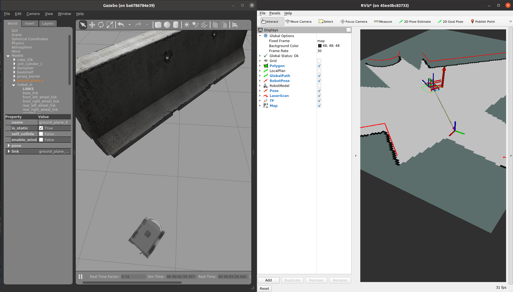
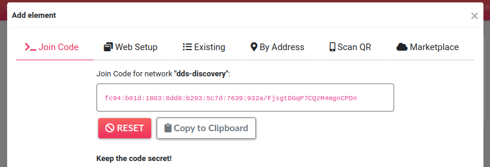

# rosdevday22-gazebo-rviz

Controlling ROSbot XL running in Gazebo on ROS DS platform from RViz running on a local computer.

## Testing everthing on local device

```
docker compose -f compose.pc.yaml -f compose.rosds.yaml up
```



## Running on remote devices

Get your Husarnet VPN `Join Code` first:

1. Log in to https://app.husarnet.com/
2. Select or create a network
3. Click the **[Add element]** button and select a `Join Code` tab:



Next create an `.env` file and place your Husarnet Join Code here:

```
HUSARNET_JOINCODE=fc94:b01d:1803:8dd8:b293:5c7d:7639:932a/xxxxxxxxxxxxxxxxxxxxxx
```

Finally, generate Husarnet `id` files to know your end-devices Husarnet IPv6 addresses before the first run. The same IP addresses are needed to be copied then to a custom `dds-config.xml` file to the section with **known hosts** (because mulitcasting over VPN is not recommended - [read more](https://husarnet.com/blog/ros2-dds-discovery-server/#using-multicasting-based-dds-simple-discovery)). Of course it could be done manually, but I have created a simple bash script to do so. Just run:

```
./generate-dds-config.sh
```

### laptop

```
docker compose -f compose.pc.yaml -f compose.pc.husarnet.yaml up
```

### ROS DS platform

Copy a `rosdevday22-gazebo-rviz/secret` folder and `.env` file from your laptop to the ROSject.

```
docker compose -f compose.rosds.yaml -f compose.rosds.husarnet.yaml up
```

After Gazebo simulation is ready you should be able to control a robot running in the ROSject from your local computer, over the Internet!