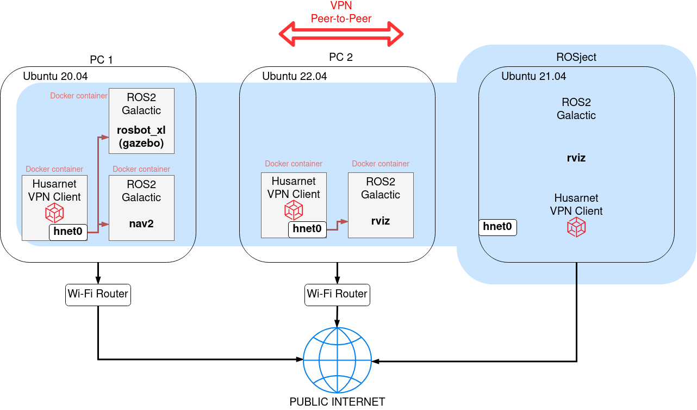
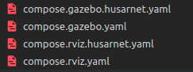

# rosdevday22-gazebo-rviz

This ROSject presents how to control [ROSbot XL](https://husarion.com/manuals/rosbot-xl) running in Gazebo simulation with using RViz running on remote computer.



> **Note**
>
> You can also run setups for PC 1 and PC 2 on the same computer.

You will learn:

- How to connect remote Docker containers running ROS 2 nodes over the Internet, and how to connect a normal host to this ROS 2 network without Docker (like a ROSject)
- How to run ROS 2 nodes in Docker the right way
- How a good Docker architecture should look like and how to appy microservice attitude to ROS 2 & Docker

> **Prerequisites**
>
> Make sure you have [Docker](https://docs.docker.com/engine/install/ubuntu/#install-using-the-repository) and [Docker Compose v2](https://docs.docker.com/compose/cli-command/#install-on-linux) installed on your laptop. Tested on Ubuntu 20.04.
>
> If you don't have, here's a quick summary for Ubuntu 20.04:
> 
> 1. Installing Docker (just click the `copy` button, and paste it to the Linux terminal):
>     ```bash
>     sudo apt-get update && sudo apt-get install -y ca-certificates curl gnupg lsb-release
>     ```
>     ```bash
>     curl -fsSL https://download.docker.com/linux/ubuntu/gpg | sudo gpg --dearmor -o /usr/share/keyrings/docker-archive-keyring.gpg
>     ```
>     ```bash
>     echo \
>     "deb [arch=$(dpkg --print-architecture) signed-by=/usr/share/keyrings/docker-archive-keyring.gpg] https://download.docker.com/linux/ubuntu \
>     $(lsb_release -cs) stable" | sudo tee /etc/apt/sources.list.d/docker.list > /dev/null
>     ```
>     ```bash
>     sudo apt-get update && sudo apt-get install docker-ce docker-ce-cli containerd.io
>     ```
>
> 2. Installing Docker Compose v2
>     ```bash
>     mkdir -p /usr/local/lib/docker/cli-plugins
>     ```
>     ```bash
>     curl -SL https://github.com/docker/compose/releases/download/v2.2.3/docker-compose-linux-x86_64 -o /usr/local/lib/docker/cli-plugins/docker-compose
>     ```
>     ```bash
>     chmod +x /usr/local/lib/docker/cli-plugins/docker-compose
>     ```
>
> The proper version of Docker and Docker Compose are already installed in the ROSject

## Clone the project repository on your laptop

If your have Docker & Docker Compose installed, all resources you need to run this project are present in [this GitHub repo](https://github.com/DominikN/rosdevday22-gazebo-rviz).

Clone it on your laptop:

```bash
git clone https://github.com/DominikN/rosdevday22-gazebo-rviz.git
```

## [Task 1] Testing everything on your laptop

Before we dive into distributing our Docker container based setup across multiple computers by using [Husarnet P2P VPN Client](https://husarnet.com/), let's just run our setup on a single computer, without any VPN at all.

On your laptop, open the Linux terminal and run:

```
xhost local:root
docker compose -f compose.rviz.yaml -f compose.gazebo.yaml up
```

After a while your should be able to control Gazebo simulation by using RViz.


Note that we started containers defined in two `compose.*.yaml` files at once. If you specify multiple files with `-f` flag, compose will merge all files into a single setup executed at once.

This pattern will be very handy while executing `compose.rviz.yaml` and `compose.gazebo.yaml` files on remote computers, because there will be no code repetition, and we will simply define additional `compose.*.husarnet.yaml` files that will extend containers setups allowing them to talk over Husarnet VPN.




In a similar way, if you would need to run your container based setup in LAN, you would define `compose.*.lan.yaml` files with a setup specific for LAN networking. This approach with separate `compose.*.yaml` files for ROS setup and for network setup will make your projects clearner and easier to maintain.

## [Task 2] Running on remote devices

Now let's connect Docker containers running on remote computer with using Husarnet VPN running in a Docker Container. Thanks to that approach we do not need to install Husarnet natively on our devices that keeps the setup safer (Docker host OS can not be accessed) and easier to start.

To connect your containers over the Internet get your Husarnet VPN `Join Code` first:

1. Log in to https://app.husarnet.com/
2. Select or create a network
3. Click the **[Add element]** button and select a `Join Code` tab:


Next create an `.env` file and place your Husarnet Join Code here:

```
HUSARNET_JOINCODE=fc94:b01d:1803:8dd8:b293:5c7d:7639:932a/xxxxxxxxxxxxxxxxxxxxxx
```

Finally, generate Husarnet `id` files to know your end-devices Husarnet IPv6 addresses before the first run. The same IP addresses are needed to be copied then to a custom `dds-config.xml` file to the section with **known hosts** (because mulitcasting over VPN is not recommended - [read more](https://husarnet.com/blog/ros2-dds-discovery-server/#using-multicasting-based-dds-simple-discovery)). Of course it could be done manually, but I have created a simple bash script to do so. Just run:

```
./generate-dds-config.sh
```

Now on the same, or on different hosts (laptops), in the same or different networks launch Docker deployments for `rviz` and `gazebo`:

### PC 1: running `rviz`

```
xhost local:root
docker compose -f compose.rviz.yaml -f compose.rviz.husarnet.yaml up
```

### PC 2: running `gazebo`

```
xhost local:root
docker compose -f compose.gazebo.yaml -f compose.gazebo.husarnet.yaml up
```

At this point you should be able to control the ROSbot XL simulation model from RViz running on the other computer.

### ROS DS platform

OK, so you know how to run dockerized setup on two different devices. So right now let's try to control the Gazebo model running on your laptop from RViz running in the ROS DS.

This ROSject is based on ROS 2 Galactic that is shipped with a Cyclone DDS by default. Let's install FastDDS to keep the same RMW (ROS Middleware) implementation for the whole system. 

Run all commands bellow in your ROSject. It's handy to do it as a root user:

```
sudo su
```

#### Connecting to your Husarnet network

ROSjects are Docker containers by their own and we can not run our own containers inside. So we need to configure everything on the "ROSject host" level, without Docker. 

Husarnet VPN client is preinstalled inside this ROSject.  ROSjects don't have systemd, so to start Husarnet daemon, open a new terminal window and run:

```
sudo husarnet daemon
```

Open one more terminal window and execute:

```
sudo husarnet join fc94:b01d:1803:8dd8:b293:5c7d:7639:932a/xxxxxxxxxxxxxxxxxxxxxx my_rosject
```

...  to connect your ROSject to the same Husarnet network as containers running on your laptop. Of course instead of `fc94:b01d:1803:8dd8:b293:5c7d:7639:932a/xxxxxxxxxxxxxxxxxxxxxx` use your own Husarnet Join Code (the same as you placed in `.env` file before).

#### Installing FastDDS

```
apt-get update && apt-get install -y ros-${ROS_DISTRO}-rmw-fastrtps-cpp
```

#### Create a custom XML config for DDS

Read your Husarnet IPv6 address and copy it:

```
user:~$ sudo husarnet status
Version: 2020.06.29.1
Husarnet IP address: fc94:252c:ccb0:11db:9e63:e5a3:d6c4:ab5c
UDP connection to base: [188.165.23.196]:5582
Peer fc94:b01d:1803:8dd8:b293:5c7d:7639:932a
  addresses from base=[51.178.64.85]:1056 [51.178.64.85]:5582 [127.0.0.1]:5582 [172.20.0.3]:5582
  tunnelled
  secure connection established
```

Create the `dds-config.xml` file in the `/home/user` directory, and paste the content of `rosdevday22-gazebo-rviz/secret/dds-config.xml` file from your laptop. Add a new record with your ROSject's Husarnet IPv6 address:

```xml
<?xml version="1.0" encoding="UTF-8" ?>
<dds>
    <profiles xmlns="http://www.eprosima.com/XMLSchemas/fastRTPS_Profiles">
        <transport_descriptors>
            <transport_descriptor>
                <transport_id>udpv6_transport</transport_id>
                <type>UDPv6</type>
                <maxInitialPeersRange>40</maxInitialPeersRange>
                <!-- <non_blocking_send>true</non_blocking_send> -->
            </transport_descriptor>
        </transport_descriptors>

        <participant profile_name="husarnet_simple_profile" is_default_profile="true">
            <rtps>
                <userTransports>
                    <transport_id>udpv6_transport</transport_id>
                </userTransports>
                <useBuiltinTransports>false</useBuiltinTransports>
                <defaultUnicastLocatorList>
                    <locator>
                        <udpv6>
                            <address>fc94:8da9:3bfe:bcc6:xxxx:xxxx:xxxx:xxxx</address>
                        </udpv6>
                    </locator>
                    <locator>
                        <udpv6>
                            <address>fc94:8f7d:2313:xxxx:xxxx:xxxx:xxxx:xxxx</address>
                        </udpv6>
                    </locator>
                    <locator>
                        <udpv6>
                            <!-- Place the ROSject's IPv6 address here -->
                            <address>fc94:252c:ccb0:11db:9e63:e5a3:d6c4:ab5c</address>
                        </udpv6>
                    </locator>
                </defaultUnicastLocatorList>
                <builtin>
                    <initialPeersList>
                        <locator>
                            <udpv6>
                                <address>fc94:8da9:3bfe:bcc6:xxxx:xxxx:xxxx:xxxx</address>
                            </udpv6>
                        </locator>
                        <locator>
                            <udpv6>
                                <address>fc94:8f7d:2313:xxxx:xxxx:xxxx:xxxx:xxxx</address>
                            </udpv6>
                        </locator>
                        <locator>
                            <udpv6>
                                <!-- Place the ROSject's IPv6 address here -->
                                <address>fc94:252c:ccb0:11db:9e63:e5a3:d6c4:ab5c</address>
                            </udpv6>
                        </locator>
                    </initialPeersList>

                    <metatrafficUnicastLocatorList>
                        <locator>
                            <udpv6>
                                <address>fc94:8da9:3bfe:bcc6:xxxx:xxxx:xxxx:xxxx</address>
                            </udpv6>
                        </locator>
                        <locator>
                            <udpv6>
                                <address>fc94:8f7d:2313:xxxx:xxxx:xxxx:xxxx:xxxx</address>
                            </udpv6>
                        </locator>
                        <locator>
                            <udpv6>
                                <!-- Place the ROSject's IPv6 address here -->
                                <address>fc94:252c:ccb0:11db:9e63:e5a3:d6c4:ab5c</address> 
                            </udpv6>
                        </locator>
                    </metatrafficUnicastLocatorList>     
                </builtin>
            </rtps>
        </participant>
    </profiles>
</dds>
```

Save the file.

#### Running the RViz with FastDDS and a custom XML configuration

In the ROSject create `/home/user/.rviz2/default.rviz` file and paste `rosdevday22-gazebo-rviz/config/slam.rviz` file content inside. Thanks to that we will use a 

Now execute this command in the ROSject's Linux terminal and control your Gazebo model (running on your laptop) remotely:

```
RMW_IMPLEMENTATION=rmw_fastrtps_cpp \
FASTRTPS_DEFAULT_PROFILES_FILE=/home/user/dds-config.xml \
ros2 run rviz2 rviz2
```

## Summary & further tips

You learned how to connect ROS 2 nodes running on remote laptops, both in Docker and operating directly on your host OS.

This is the most basic setup for FastDDS. If you would like to connect multiple devices running ROS 2 over the Internet, FastDDS offers a [Discovery Server](https://husarnet.com/blog/ros2-dds-discovery-server) and a [DDS Router](https://husarnet.com/blog/ros2-dds-router/), that will make your system much more scalable.

To run the same Docker setup as presented in this instruction, but with a Discovery Server or DDS Router, just take a look at different branches of this repo, eg.:

```
git clone https://github.com/DominikN/rosdevday22-gazebo-rviz.git
git checkout dds-router
```

